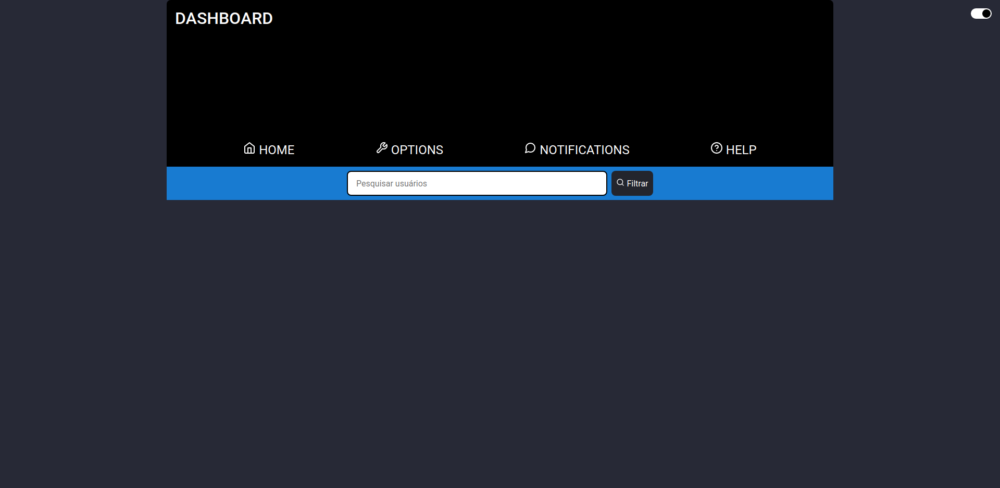
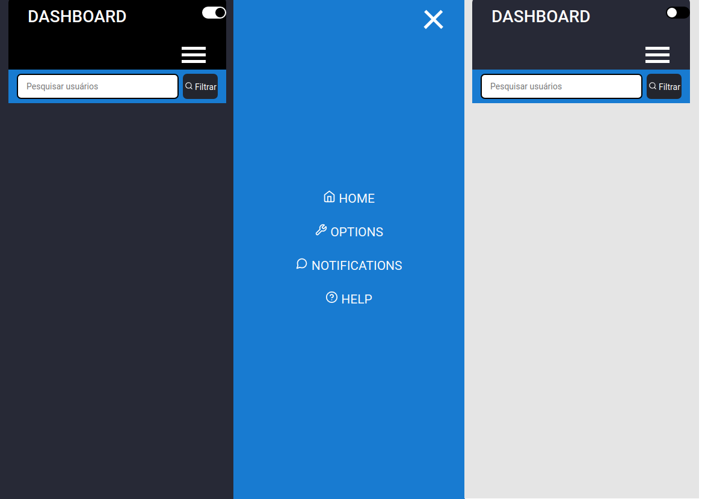

<h1 align="center">
   AnyApp
</h1>

 

## :camera: Demonstração

## :rocket: Tecnologias

Esse projeto foi desenvolvido com as seguintes tecnologias:

✔️Typescript

✔️React

✔️React-Hook-Form

✔️Yup

✔️SWR

✔️Web Storage API

✔️Axios

✔️Json-server

✔️React-Router-Dom

✔️Context API

✔️React Hooks

✔️React-Toastify

✔️React-Icons

✔️Styled-components

## 💻 Projeto

AnyApp simula uma aplicação com cadastro e login, onde o usuário deve cadastrar-se com um e-mail e uma senha e em seguida logar-se para acessar as funcionalidades internas da aplicação.

## ⚙ Configuração

1- Para instalar as dependências:

> yarn

2- Para iniciar a aplicação digite cada comando em 2 terminais paralelos diferentes:

> yarn server

> yarn dev
